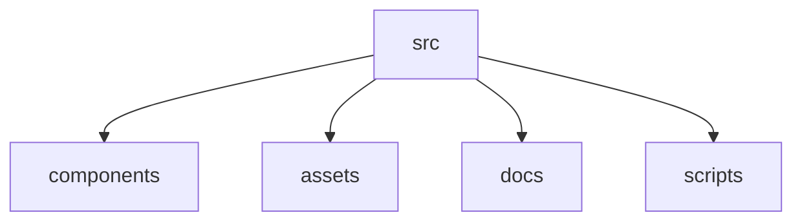

# Portfolio Website

This is a portfolio website project with improved structure and documentation.

## Project Structure
- /src/components: Reusable UI components
- /src/assets: Media assets
- /docs: Project documentation
- /scripts: Build and deployment scripts

## Documentation
- [Architecture Decisions](/docs/architecture.md)
- [Component Guidelines](/docs/components.md)
- [Folder Structure](/docs/folder-structure.md)

## Getting Started
**Prerequisites:** Node.js

1. Install dependencies:
   `npm install`
2. Set environment variables in [.env.local](.env.local)
3. Run the app:
   `npm run dev`

## Folder Structure Diagram

## Contributing
See [CONTRIBUTING.md](CONTRIBUTING.md)

## Change Log
See [CHANGELOG.md](CHANGELOG.md)
